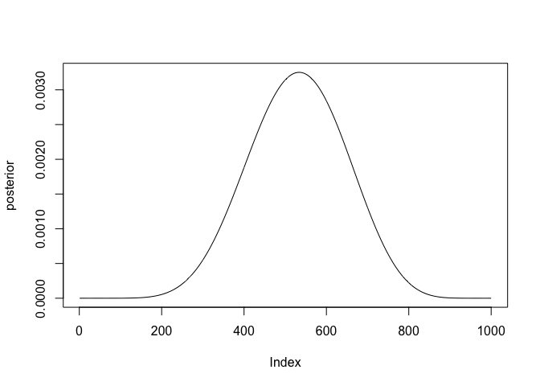

# Statistical Rethinking Chapter 3 problems

__Name__: Ellis Anderson

## Homework Setup


```r
library(rethinking)
p_grid <- seq(from=0, to=1, length.out=1000)
prior <- rep(1,1000)
likelihood <- dbinom(6, size =9, prob = p_grid)
posterior <- likelihood * prior
posterior <- posterior/sum(posterior)
set.seed(100)
samples <- sample(p_grid, prob=posterior, size = 1e4, replace=TRUE)
```

## 3E1
  

```r
sum(samples < .2)/1e4
```

```
## [1] 5e-04
```

## 3E2


```r
sum(samples > .8)/1e4
```

```
## [1] 0.1117
```

## 3E3


```r
sum(samples < .8 & samples > .2)/1e4
```

```
## [1] 0.8878
```

## 3E4


```r
quantile(samples, .2)
```

```
##       20% 
## 0.5195195
```

## 3E5


```r
quantile(samples, .8)
```

```
##       80% 
## 0.7567568
```

## 3E6


```r
HPDI(samples, prob = .66)
```

```
##     |0.66     0.66| 
## 0.5205205 0.7847848
```

## 3E7


```r
PI(samples, prob = .66)
```

```
##       17%       83% 
## 0.5005005 0.7687688
```

## 3M1


```r
p_grid <- seq(from=0, to=1, length.out=1000)
prior <- rep(1,1000)
likelihood <- dbinom(8, size = 15, prob = p_grid)
posterior <- likelihood * prior
posterior <- posterior/sum(posterior)
```



## 3M2


```r
samples <- sample(p_grid, prob=posterior, size = 1e4, replace = TRUE)
HPDI(samples, prob=.9)
```

```
##      |0.9      0.9| 
## 0.3383383 0.7317317
```

_STOP AFTER 3M2 FOR 02/25 ASSIGNMENT_

## 3M3

## 3M4

## 3M5

## 3H1

## 3H2

## 3H3

## 3H4

## 3H5
